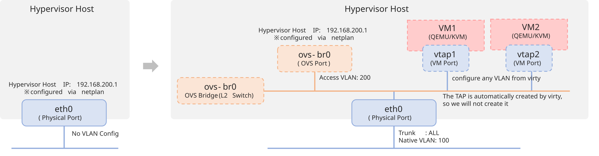

# Virty

[](https://github.com/hibiki31/virty/actions/workflows/docker-image.yml)
[
](https://hibiki31.github.io/virty/)

KVM management web application for low cost and immediate deployment.
Manage nodes with SSH access using Libvirt-API, Ansible, etc.

Nodes are Linux with SSH connectivity and provisioning can be done through the UI.


### Disclaimer

The author is not responsible for any damage caused by the use of this software.

### Quick Start

The bundled web container listens over HTTP. Keep direct HTTP access on loopback or a
trusted private network. TLS is optional and is terminated by an operator-managed reverse
proxy or load balancer. The WebAuthn and device-bound Agent API require an HTTPS origin in
production and must not be exposed directly to the internet.

```
mkdir virty
cd virty
wget https://raw.githubusercontent.com/hibiki31/virty/refs/heads/master/compose.example.yml -O compose.yml
export VIRTY_BIND_ADDRESS="127.0.0.1"
export VIRTY_PUBLIC_URL="http://localhost:8765"
export VIRTY_WEBAUTHN_RP_ID="localhost"
export VIRTY_SECRET_KEY="$(openssl rand -hex 32)"
export VIRTY_AGENT_LEASE_SIGNING_KEY="$(openssl rand -hex 32)"
export VIRTY_AGENT_TASK_ENCRYPTION_KEY="$(openssl rand -base64 32)"
# Agentからimage downloadを許す場合だけ、信頼するHTTPS hostを列挙する。
export VIRTY_AGENT_IMAGE_DOWNLOAD_ALLOWED_HOSTS="images.example.internal"
docker compose up -d
```

Store these values in a root-readable environment file before a production restart;
generating new signing keys invalidates active sessions and Agent leases. Once activated,
access `http://localhost:8765`. For remote access or Agent operations, follow the
[external HTTPS setup](mkdocs/setup/nginx.md), bind Virty to the proxy-facing interface,
and set `VIRTY_PUBLIC_URL` to the browser-visible HTTPS origin.

### API compatibility note

The Japanese/English UI release makes a breaking change to every REST and Agent API
error response. Clients must read `detail.code` and `detail.message` from the common
structured envelope; the former REST `detail` string/list is no longer returned.
Agent clients can continue to use `detail.code`, but validation entries now use
`errors[].code` instead of `errors[].type`, and `detail.message` is an English fallback.
HTTP status codes and authentication headers remain unchanged.


### Preparation of managed nodes

Select the text editor to use (optional).

```
sudo update-alternatives --config editor
```

Grant sudo privileges without password to the user connecting to SSH.

```
sudo visudo
-- end --
username ALL=(ALL) NOPASSWD: ALL
```

Use public key authentication.
The key registered here will be added on the dashboard.

```
ssh-copy-id user@host
```

### Open vSwitch (Optional)

#### Configuration

This example has only one nic.
It is recommended to do this from the Console since the network is usually disconnected once.



| name               | value            |
| ---------------------- | ------------- |
| Bridge name               | ovs-br0       |
| Physical interface | eth0          |
| Native VLAN            | 100           |
| VLAN to configure IP       | 200           |
| IP                     | 192.168.200.1 |

#### Package (Ubuntu)

```bash
sudo apt update
sudo apt install openvswitch-common openvswitch-switch
sudo systemctl status openvswitch-switch.service
```

#### Creating Bridges

If you have only one interface and SSH, you can switch IPs by devising the following. If you want to configure Vlan or other settings, you need to connect further commands.

```bash
sudo ovs-vsctl add-port ovs-br0 eth0 ; sudo netplan apply
```

Setting Example

```bash
sudo ovs-vsctl add-br ovs-br0
sudo ovs-vsctl add-port ovs-br0 eth0
sudo ovs-vsctl set port ovs-br0 tag=200 # Not required if vlan is not used
sudo ovs-vsctl set port eth0 tag=100 vlan_mode=native-untagged # Not required if vlan is not used
ovs-vsctl show
```

Netplan Example

```yaml
network:
  ethernets:
    eth0:
      dhcp4: false
    ovs-br0:
      dhcp4: false
      addresses:
        - 192.168.200.1/24
      gateway4: 192.168.200.254
      nameservers:
        addresses: [ 192.168.200.254 ]
  version: 2
```


### Backup

```
docker-compose exec db pg_dump -U postgres mydatabase > virty_db_`date -Iseconds`.dump
```
