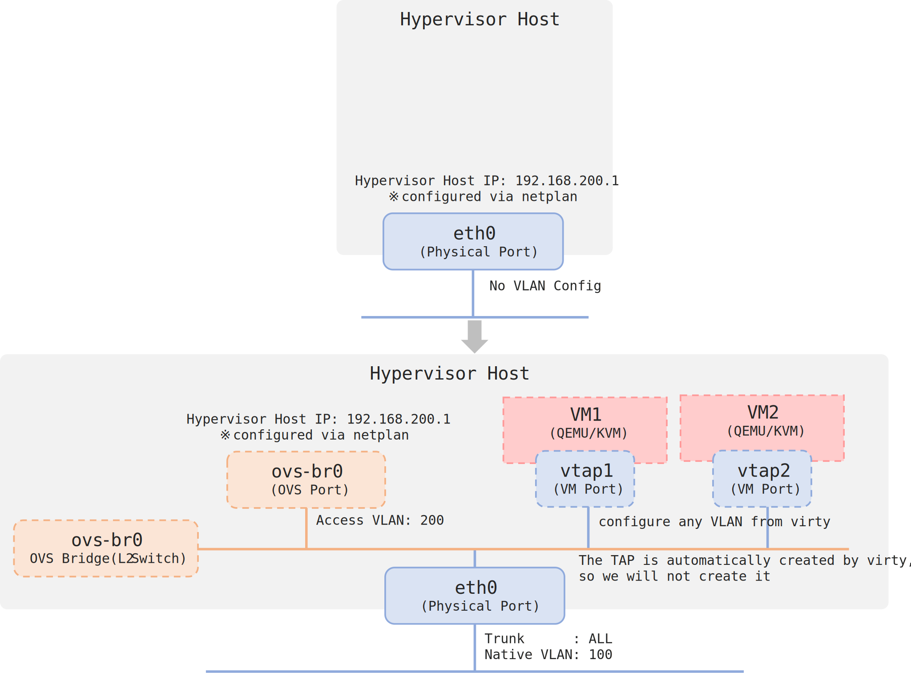

# Open vSwitch VLAN

Open vSwitchを利用して、VMにダッシュボードからVLANを設定できるようにします。ノード上での作業は以下の構築作業1回だけです。

## 設定内容

ノードのNICが1つのケースで、管理用（ホストにSSHしたりVirtyへアクセスしたり）としても使っている想定です。



今回の設定値は以下の通りです。

| name               | value            |
| ---------------------- | ------------- |
| Bridge name               | ovs-br0       |
| Physical interface | eth0          |
| Native VLAN            | 100           |
| VLAN to Host IP       | 200           |
| Host IP                     | 192.168.200.1 |

!!! note
    わかりやすくするため、Native VLANやホスト用VLANの値を設定しています。普通に両方1のケースのほうが多いと思います。

## パッケージのインストール

```bash
sudo apt update
sudo apt install openvswitch-common openvswitch-switch
sudo systemctl status openvswitch-switch.service
```

## ブリッジの作成

!!! danger
    この手順を普通に実施すると、管理用のIPが一時的に利用できなくなるのでSSHが途切れます。困る場合は`ブリッジの作成(無停止)`を実施してください。`ブリッジの作成(無停止)`は説明を簡略化しているので、実施の流れはこちらを確認の上行ってください。

```bash
sudo ovs-vsctl add-br ovs-br0
sudo ovs-vsctl add-port ovs-br0 eth0
```

ホストが利用するNICにVLANを設定します。利用しない場合は実行しないでください。

```bash
sudo ovs-vsctl set port ovs-br0 tag=200 
```

eth0のNative VLANを設定します。接続するスイッチのトランク設定などを確認して設定してください。

```bash
sudo ovs-vsctl set port eth0 tag=100 vlan_mode=native-untagged
```

設定内容の確認

```bash
ovs-vsctl show
```

eth0に設定していたnetplanの設定内容をそのままovs-br0に記載します。このovs-brがホスト用のNICとして利用されます。(ex. SSH, Virty)

```yaml
network:
  ethernets:
    eth0:
      dhcp4: false
    ovs-br0:
      dhcp4: false
      addresses:
        - 192.168.200.1/24
      gateway4: 192.168.200.254
      nameservers:
        addresses: [ 192.168.200.254 ]
  version: 2
```

設定を適応します。

```bash
sudo netplan apply
```

## ブリッジの作成(無停止)

!!! danger
    この手順を普通に実施すると、想定通りであれば、再びSSHができるようになります。失敗するとSSH接続ができなくなるため細心の注意を払ってください。

netplanの設定移植

```yaml
network:
  ethernets:
    eth0:
      dhcp4: false
    ovs-br0:
      dhcp4: false
      addresses:
        - 192.168.200.1/24
      gateway4: 192.168.200.254
      nameservers:
        addresses: [ 192.168.200.254 ]
  version: 2
```

!!! warning
    MACアドレスの一致ルールなどが書いてあると失敗するので注意
    ```yaml
    network:
        version: 2
        ethernets:
            ens3:
            match:
                macaddress: "00:16:3e:2c:c8:2e"
            dhcp4: true
            dhcp6: true
            set-name: "ens3"
    ```

netplanの設定確認(構文チェック)

```bash
sudo netplan generate
```

先に実施できるコマンドを実行

```bash
sudo ovs-vsctl add-br ovs-br0
sudo ovs-vsctl set port ovs-br0 tag=200 
```

一括で実行

```bash
sudo ovs-vsctl add-port ovs-br0 eth0; sudo ovs-vsctl set port eth0 tag=100 vlan_mode=native-untagged; sudo netplan apply
```
